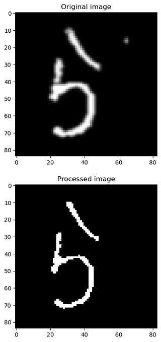

# Nihongo Hiragana Recognition
This project trains convolutional neural networks (CNNs) model to recognize various Hiragana handwritten images, giving a 97\% accuracy and 0.97 F1 score. Please refer to `hiragana_recognition.ipynb` for the demonstration.

## Data sources
The 1000 images of the dataset come from Matheus Inoue's [hirgana-dataset](https://github.com/inoueMashuu/hiragana-dataset) on his Github repository.
An additional 405 images are provided to increase the dataset size and variety and are stored in `./handwriting_wishyut`.

The dataset thus contains 1405 images, each of them containing a handwritten Hiragana character. There are total 50 Hiragana characters, with each character corresponding to 20-29 images.

## Methodology
The images are imported and preprocessed using `cv2`.

The training set of 1405 images is split into training data and testing data with a 85:15 ratio. The training data is further split into trainging set and validation set. A CNN model is constructed to train on the training set and be validated by the validation set. The CNN model consists of two convolution blocks and one dense layer, each convolution block containing two convolution layers and a maxpooling layer.

The trained model is then evaluated on the testing data (total 211 images split from the data). A 5-fold cross validation test is further constructed from the training data to test the integrity of the model.

## Results
Among the five trained cross validation models, the F1 score mean is 0.96 with standard deviation of 0.02, proving the good integrity of the model.

The final trained model is selected by the model of the five validation models with the lowest cost. Evaluated by the testing data, it reaches 97\% accuracy and 0.97 F1 score.

The model is then tested by 92 handwritten Hiragana images of my own, reaching 77\% accuracy. Plese tke a look at `./test_my_handwriting`.

## Modules used
External libraries used:
* `numpy`: Calculates and manipulates matrices (images)
* `pandas`: Constructs a datatable to organize and manipulate all data
* `cv2`: Reads and preprocesses images
* `matplotlib`: Plots images with `pyplot`
* `sklearn`: Splits and shuffles data into training and testing by `model_selection.train_test_split`
* `tensorflow.keras`: Augments training data by `preprocessing.image.ImageDataGenerator`. Categorizes data in one-hot encoding by `utils.np_utils`. Constructs a CNN model by `models`, `layers`.

Internal modules used:
* `os`: Finds paths and files
* `re`: Extracts "Romanji" (pronunciation of Hiragana) from each filename

## Programs  included
* `hiragana_recognition.ipynb`: 
    * `organized_data.py`, `label_process.py`: Preprocesses data and extracts "Romanji labels" using `os`, `re`, `numpy`, `pandas`, `cv2`, `sklearn`.
    * `image_process.py`: Preprocesses images, eliminates noises using `cv2`.
    * Augments training data via `ImageDataGenerator`.
    * `ml_model.py`: Trains the CNN model by `keras`.
    * `demonstration.py`: Plots the confusion matrix and the wrong predictions with `pyplot`.
* `model_hiragana_recognition_cnn.h5`: Saved model trained in `hiragana_recognition.ipynb`.
* `test_loadmodel.ipynb`: Loads `model_hiragana_recognition_cnn.h5` and certifies that it can be used on recognizing handwritten Hiraganas.
